# Ren Browser

A modern browser for Reticulum Network using Reticulum-Go and Micron-Parser-Go.

This project is under heavy active development and may be unstable on some platformas until v1.0

<p align="center">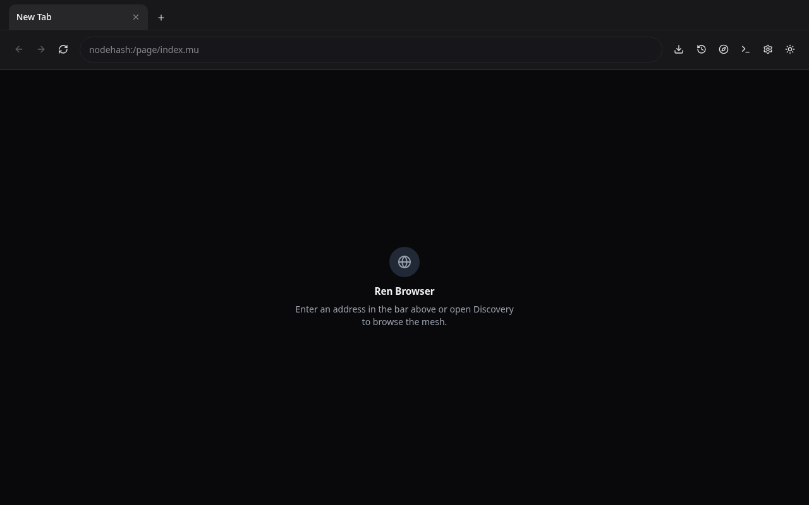</p>

<details>
<summary>Desktop (dark and light)</summary>

<p align="center">
  
  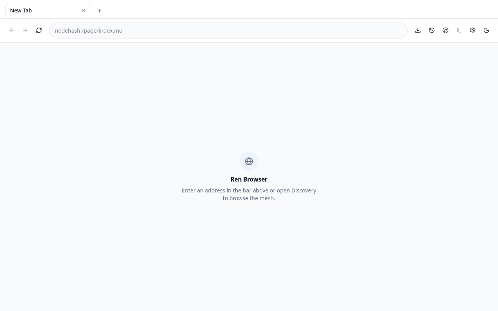
</p>

<p align="center">
  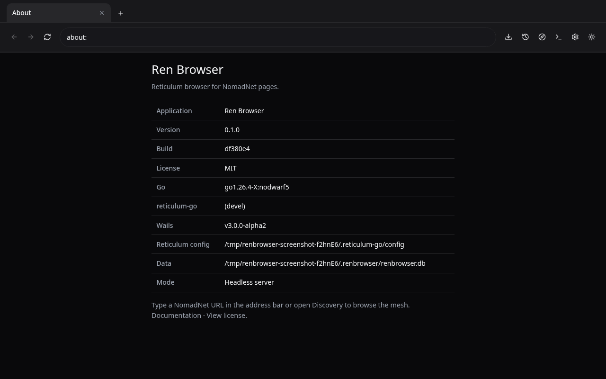
  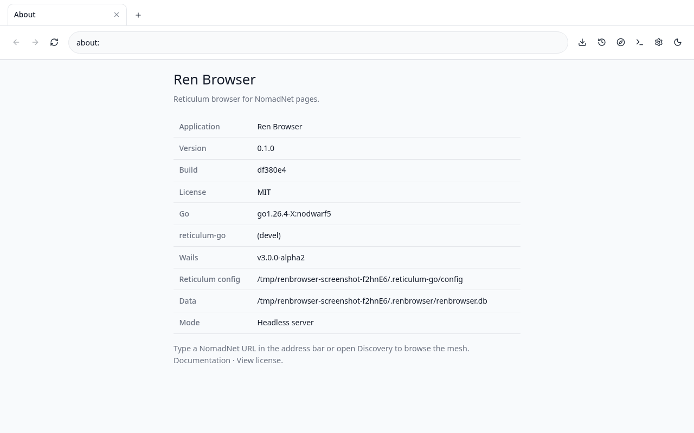
</p>

<p align="center">
  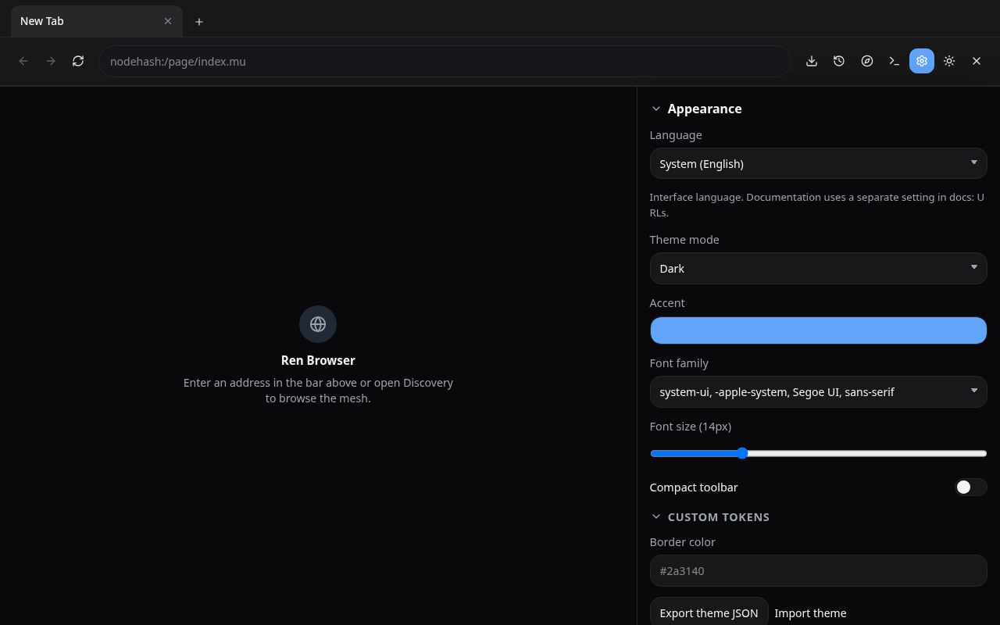
  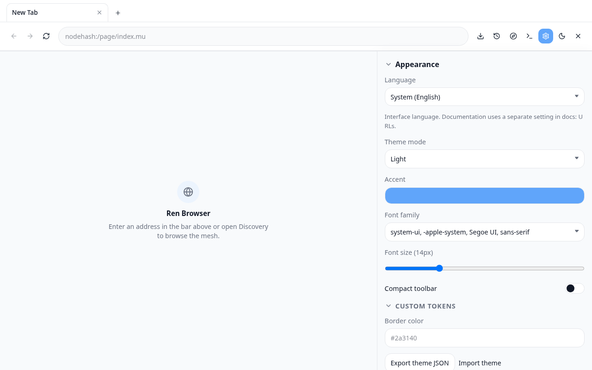
</p>

<p align="center">
  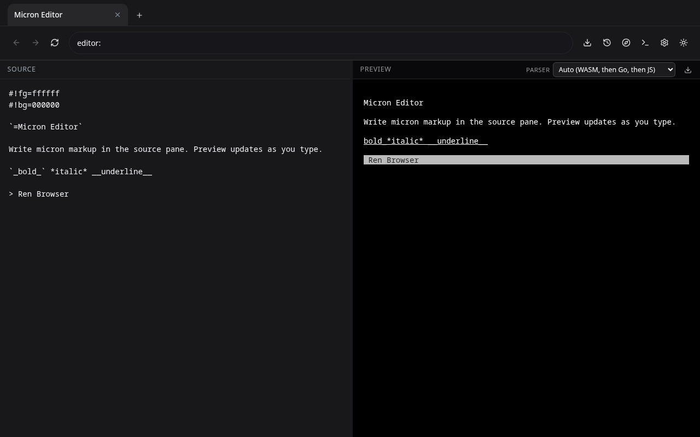
  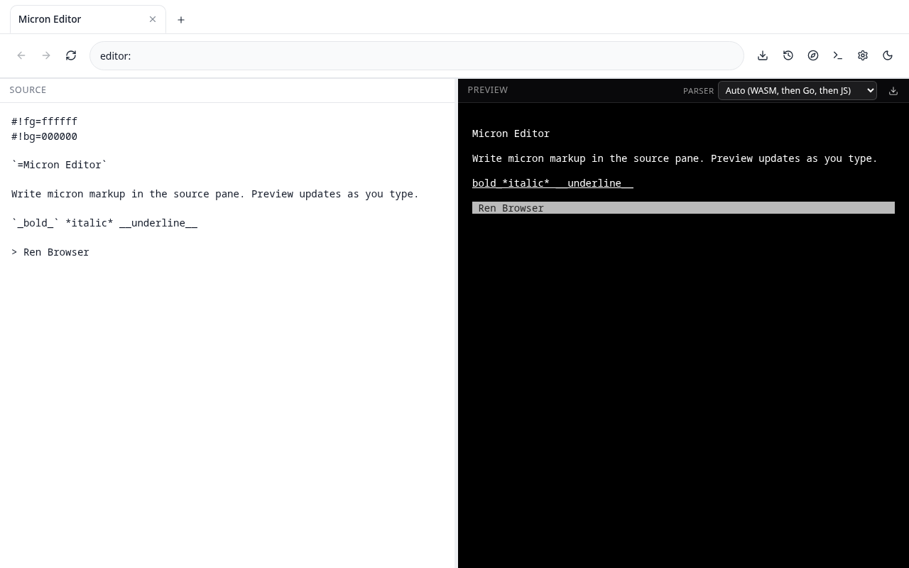
</p>

<p align="center">
  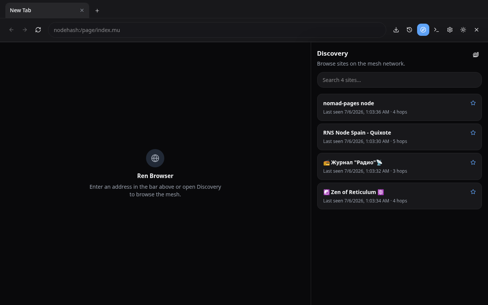
  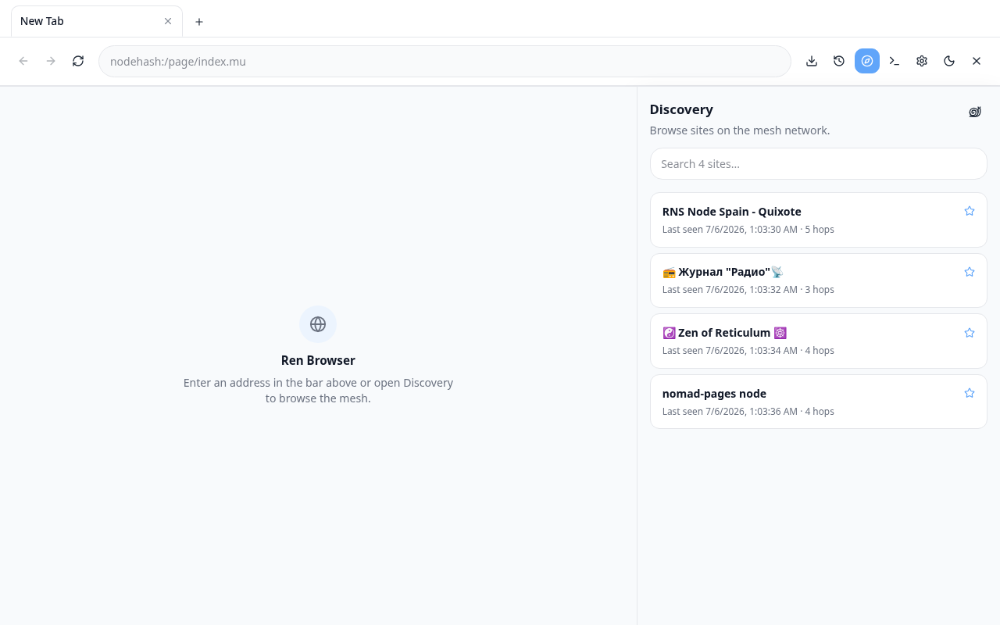
</p>

</details>

<details>
<summary>Mobile (dark and light)</summary>

<p align="center">
  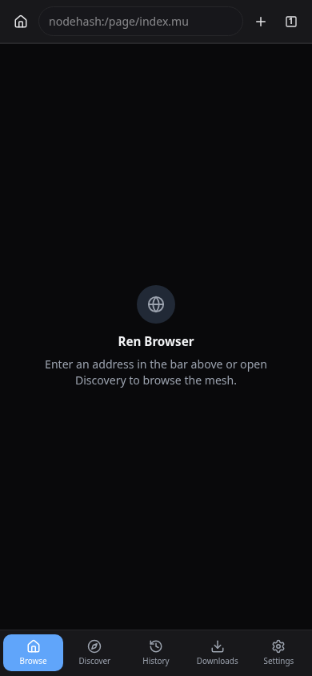
  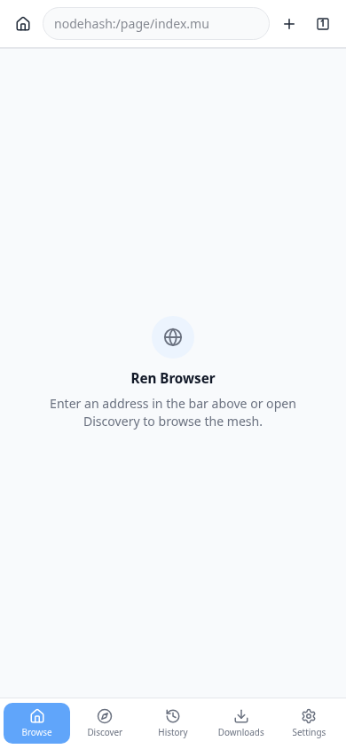
</p>

<p align="center">
  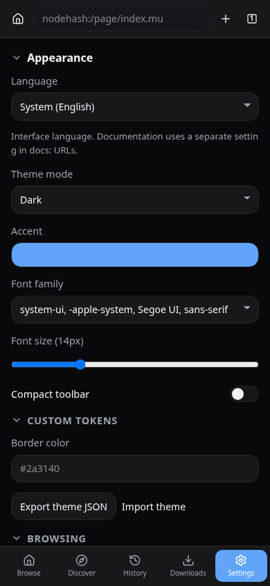
  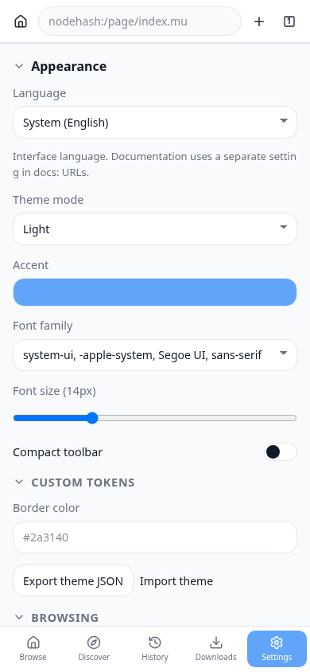
</p>

</details>

## Features

- **NomadNet compatible** - renders Micron (`.mu`) pages served over Reticulum.
- **Full interface control** - Hot reload interfaces.
- **Multiple identities** - create, import, export, rename, and switch between Reticulum identities.
- **Document reader** - open epub and PDF files downloaded over the network.
- **Micron editor** - write and preview `.mu` pages.
- **Extension system** - install JS or WASM plugins with per-permission grants (network, storage, navigation).
- **Runs anywhere** - desktop builds for Linux, Windows, and macOS, an Android APK, and a headless server binary/Docker image for your server or rpi zero w.
- **Localized UI** - English, German, Spanish, and Russian, with more community translations welcome.

## Documentation

Guides by language in [docs/](docs/):

| Language | Folder |
|----------|--------|
| English | [docs/en/](docs/en/) |
| Russian | [docs/ru/](docs/ru/) |
| Spanish | [docs/es/](docs/es/) |
| German | [docs/de/](docs/de/) |

Start with [Getting started](docs/en/getting-started.md) in your language.

## Install

### Pre-built downloads

Grab the latest release for your system from [GitHub Releases](https://github.com/Quad4-Software/Ren-Browser/releases).

#### System requirements

| Package | What you need on the host |
|---------|---------------------------|
| **Linux AppImage** | Bundles GTK 4, WebKitGTK 6, and other libraries via linuxdeploy. No separate WebKit install. Some distros need FUSE or `APPIMAGE_EXTRACT_AND_RUN=1`. |
| **Linux Flatpak** | Flatpak plus the `org.gnome.Platform` runtime (GTK 4 and WebKitGTK 6). The app bundle does not ship those runtimes itself. |
| **Linux Arch package** | GTK 4 and WebKitGTK 6.0 from pacman (`sudo pacman -U renbrowser-linux-*.pkg.tar.zst`). |
| **Linux plain binary** | GTK 4 and WebKitGTK 6.0 at runtime, for example `libgtk-4-1` and `libwebkitgtk-6.0-4` on Debian/Ubuntu 24.04+, Fedora, or Arch. |
| **Windows `.exe`** | [Microsoft Edge WebView2 Runtime](https://developer.microsoft.com/microsoft-edge/webview2/). Usually already on Windows 10/11. The NSIS installer can install it if missing; the portable `.exe` does not. |
| **macOS `.app`** | Recent macOS with the system WebKit framework (no extra browser runtime to install). |
| **Android APK** | Android 5.0 or newer (API 21+). Universal APK covers arm64 and 32-bit ARM. |
| **Server binary / Docker** | No desktop GUI stack. Static Linux/FreeBSD/NetBSD builds; OpenBSD may link against the system libc. Docker image is linux amd64 only. |

### Docker or Podman

The published image is `ghcr.io/quad4-software/renbrowser`.

Mount your Reticulum config so the container can join the mesh. The image runs as a non-root user, so pass your host UID/GID and map config and profile data under `/data`:

```sh
docker run --rm -p 8080:8080 \
  --user "$(id -u):$(id -g)" \
  -e HOME=/data \
  -v "$HOME/.reticulum-go:/data/.reticulum-go" \
  -v "$HOME/.renbrowser:/data/.renbrowser" \
  -e REN_BROWSER_CONFIG=/data/.reticulum-go/config \
  ghcr.io/quad4-software/renbrowser:latest
```

The same flags work with `podman run` instead of `docker run`. On Podman you can use `--userns=keep-id` instead of `--user "$(id -u):$(id -g)"`. If SELinux blocks the bind mount, add `:Z` to the volume flags (for example `-v "$HOME/.reticulum-go:/data/.reticulum-go:Z"`).

Then open `http://localhost:8080` in any browser on the same machine.

For a custom build from this repo:

```sh
task build:docker
task run:docker
```

The server image currently has **no login screen**. Only expose it on networks you trust, or put it behind a reverse proxy with access controls. See [SECURITY.md](SECURITY.md).

### Build from source

For contributors or platforms without a pre-built package.

**You will need:**

- [Go](https://go.dev/) 1.26 or newer
- WebKitGTK-6.0 (for wails desktop apps)
- [Node.js](https://nodejs.org/) 22+ and [pnpm](https://pnpm.io/) 11+
- [Task](https://taskfile.dev/) (optional, recommended)
- Reticulum config at `~/.reticulum-go/` (or set `REN_BROWSER_CONFIG`)

**Steps:**

```sh
git clone https://github.com/Quad4-Software/Ren-Browser.git
# or via rngit: git clone rns://06a54b505bb67b25ef3f8097e8001edc/public/ren-browser
cd Ren-Browser
task build
# or make build
./bin/renbrowser
```

Go modules pull Quad4 dependencies from GitHub automatically; no extra repos to clone.

Platform-specific builds:

```sh
task build:windows
task build:darwin
task build:android      # universal APK (arm64 + armeabi-v7a)
task build:android:emu  # emulator (host ABI)
```

Installers (AppImage, Arch package, `.app` bundle, etc.):

```sh
task package
task package:linux:arch
```

Nix flake:

```sh
nix develop
nix build
```

Android builds need the [Android SDK](https://developer.android.com/studio) (API 34, NDK r26+). Set `ANDROID_HOME` and run `task android:install:deps` if the build complains about missing tools.

Release APK signing uses a Java keystore (`.jks` or `.keystore`), not a public certificate file. A `.p12` (PKCS#12) bundle also contains the **private** key and must be kept secret. Generate a release keystore locally (never commit it):

```sh
keytool -genkeypair -v -keystore release.keystore -alias renbrowser \
  -keyalg RSA -keysize 4096 -validity 10000
```

Point Gradle at it when packaging:

```sh
export ANDROID_KEYSTORE_FILE="$PWD/release.keystore"
export ANDROID_KEYSTORE_PASSWORD='your-store-password'
export ANDROID_KEY_ALIAS=renbrowser
export ANDROID_KEY_PASSWORD='your-key-password'
task package:android
```

#### Android memory tagging (GrapheneOS)

On GrapheneOS, memory tagging (MTE) is often enabled by default. The app manifest sets `android:memtagMode="off"`, but GrapheneOS can still force native memory tagging on the app, so that flag may not be enough.

If Ren Browser crashes on launch try turning off memory tagging for this app in system settings.

This is a known Go + MTE issue on Android ([golang/go#59090](https://github.com/golang/go/issues/59090)) next version should ship with fix.

## Using the app

- **Address bar**: enter a NomadNet destination or use built-in schemes (`about:`, `settings:`, etc.).
- **Discovery**: find nodes announced on your Reticulum interfaces.
- **Settings**: manage interfaces, themes, extensions, and profile data.
- **Data**: bookmarks, history, and tabs are stored in `~/.renbrowser/renbrowser.db`. Older `state.json` files are migrated on first launch.

Type `license` in the address bar to read the in-app license text.

## Extensions

Install extensions from **Settings → Extensions** (zip or folder), or unpack into `~/.renbrowser/plugins/<id>/` with a `renbrowser.plugin.json` manifest.

An example extension lives in `extensions/hello-extension/`. Extension authors work with permissions (storage, navigation, network, and related caps) declared in the manifest. See `internal/plugins/manifest.go` for the full schema.

## Server mode

Run Ren Browser as a web app without the desktop shell. Useful for homelab servers, Docker, or a machine that already runs Reticulum.

```sh
task build:server
./bin/renbrowser-server --host 0.0.0.0 --port 8080
```

Cross-compile headless server binaries (pure Go, `CGO_ENABLED=0`):

```sh
task build:server GOOS=linux GOARCH=arm64 OUTPUT=bin/renbrowser-server-linux-arm64
task build:server GOOS=linux GOARCH=arm GOARM=6 OUTPUT=bin/renbrowser-server-linux-armv6
task build:server GOOS=freebsd GOARCH=amd64 OUTPUT=bin/renbrowser-server-freebsd-amd64
task build:server GOOS=windows GOARCH=amd64 OUTPUT=bin/renbrowser-server-windows-amd64.exe
```

Release builds also ship `renbrowser-server-linux-amd64`, `linux-arm64`, `linux-armv6` (Raspberry Pi Zero W), `freebsd-amd64`, `freebsd-arm64`, `openbsd-amd64`, `netbsd-amd64`, and `windows-amd64` (`renbrowser-server-windows-amd64.exe`).

Common environment variables (also readable from a `.env` file in the working directory):

| Variable | Purpose |
|----------|---------|
| `WAILS_SERVER_HOST` / `REN_BROWSER_HOST` | Bind address |
| `WAILS_SERVER_PORT` / `REN_BROWSER_PORT` | Port (default `8080`) |
| `REN_BROWSER_CONFIG` | Path to Reticulum config |
| `REN_BROWSER_TRUST_PROXY` | Trust `X-Forwarded-*` from a reverse proxy |
| `REN_BROWSER_BASE_PATH` | URL prefix when served under a subpath |

Use `--public-mode` to keep favorites, history, and tabs in the browser (`localStorage`) instead of the server database.

## Development

```sh
task dev
```

Run the full quality gate before sending changes (`make check` or `task check`):

```sh
make check
task test:interop   # optional; needs a live Reticulum network
make screenshots    # optional; refresh README preview images
```

Prefer [Task](https://taskfile.dev/)? The same targets exist as `task check`, `task screenshots`, and so on. This repo also ships a [Makefile](Makefile) if you do not want Task installed.

## Project layout

| Path | Contents |
|------|----------|
| `main_desktop.go` / `main_server.go` | Desktop and headless entry points |
| `internal/` | Reticulum, NomadNet, rendering, SQLite store, plugins |
| `frontend/` | Svelte 5 UI |
| `build/` | Packaging and platform tooling |


Regenerate with `make screenshots` or `task screenshots`. Images are written under `screenshots/desktop/` and `screenshots/mobile/` in `dark/` and `light/` subfolders. On Linux you can also capture the native window after launch:

```sh
REN_BROWSER_SCREENSHOT_DIR=screenshots/desktop REN_BROWSER_SCREENSHOT_THEME=dark ./bin/renbrowser
```

## Contributing

Patches and guidance: [CONTRIBUTING.md](CONTRIBUTING.md)

Security reports: [SECURITY.md](SECURITY.md)

Legal and licensing questions: [LEGAL.md](LEGAL.md)

## License

Ren Browser is released under the [MIT License](LICENSE).
